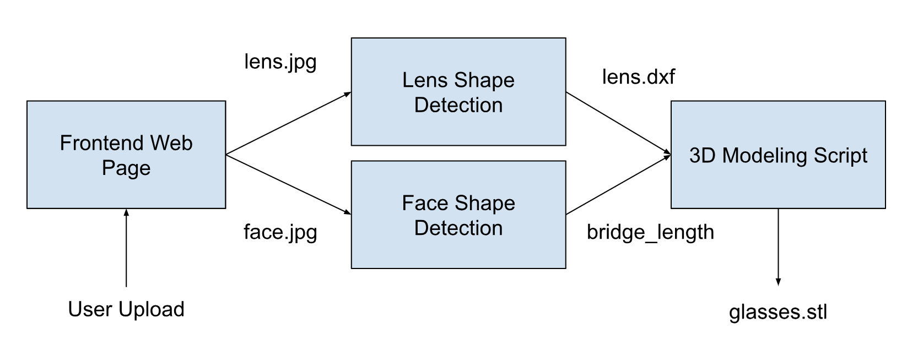

# Parametric Glasses

Process:

1. Takes in a photo of a lens and outputs a 2D file.
    1. The user takes a photograph of their lens on our calibration background, which has a blue circle. The blue circle, whose real size is known, is used to convert the pixel size of the final lens shape to its actual size in millimeters. The outline of the lens is obtained using edge detection and image filtering techniques.
2. Takes in a photo of a person's head and outputs the recommended bridge width of spectacles.
    1. The user takes a picture of himself using the app’s webcam, and the webcam automatically generates a recommended bridge length of the spectacles. For improved accuracy, it is essential for the user to face the webcam directly, maintain closeness to the camera while ensuring the entire face remains within the frame, and keep the face parallel to the webcam.
3. Produces a STL file.
    1. The user uploads an image of their lens and convert it to DXF AND/OR allowing them to upload DXF and input the bridge length parameter to generate printable STL


## Installation

```
conda create --name mediapipe_iris python=3.7
conda activate mediapipe_iris
pip install -r requirements.txt
```

Install OpenScad

## Execution

python backend.py

For isolated testing of steps 1 and 2, run

```
python3 face-landmarks.py --image_filename [input_file]

python3 lens.py [input_file] [output_file]
```

# Notes
- Designed for adult heads
- Returns default bridge width and frame width parameters if out of human range.
- Lens CV may not work for clear lenses





# Credits

Thanks to https://github.com/Morris88826/MediaPipe_Iris
